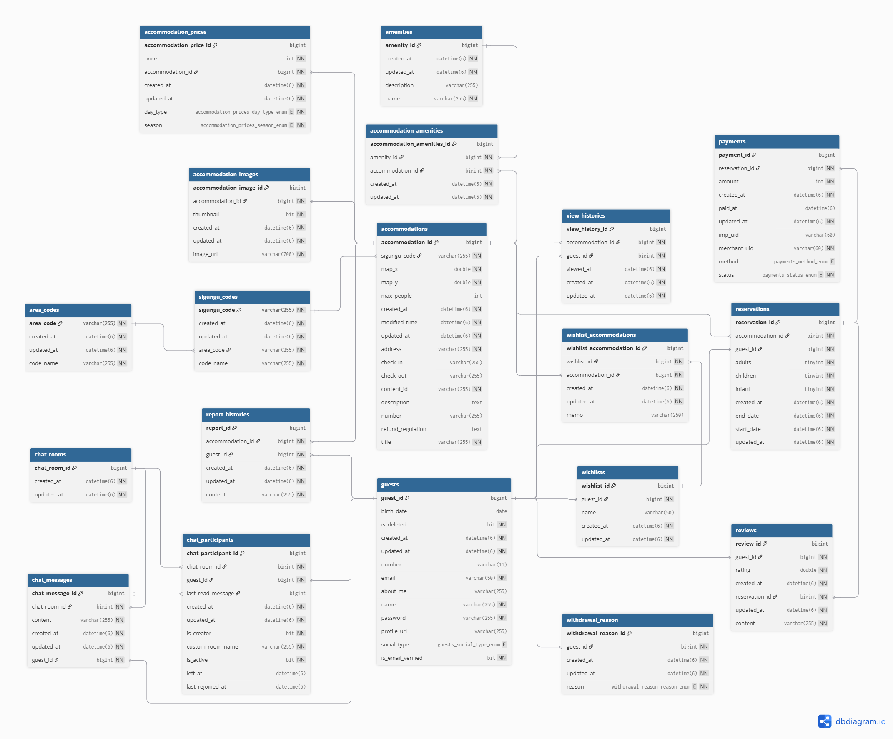

# 🏡 아늑한 밤 프로젝트

  

## 🚀 프로젝트 소개

- **아늑한 밤**은 Airbnb 서비스를 모티브로 한 숙소 예약 플랫폼 클론 코딩 프로젝트입니다.
- OpenAPI 연동으로 다양한 **실제 숙소 데이터를 확보**하였으며, **지역별·편의시설·가격별 조건으로 숙소를 검색**할 수 있습니다.
- 마음에 드는 숙소를 **위시리스트에 저장**할 수 있고, **실시간 1:1 채팅 기능**으로 사용자 간의 소통을 지원합니다.

## 👥 팀원 소개

|                                                               **장근영**                                                               |                                                                 **이동진**                                                                 |
|:-----------------------------------------------------------------------------------------------------------------------------------:|:---------------------------------------------------------------------------------------------------------------------------------------:|
| [   @geun-00](https://github.com/geun-00) | [   @ilPadrin0](https://github.com/ilPadrin0) |

## ⚙ 기술 스택

### 🧱 Core

### 🛢️ Database

### 📚 Test & Docs

 

### 🖥️ Infra

### 💬 Communication

## 📝 API 설계

👉🏻 [API 문서 보러가기](https://airbackend.jgy914.shop/api-docs)

## 🛠️ 프로젝트 아키텍쳐

### 🗺️ ERD 설계

### 🔄 CI/CD 아키텍처

<!--  -->

## 📌 TodoList
- [ ] 숙소 예약 및 결제
- [x] 여행한 숙소 리뷰 등록
- [x] 내가 여행한 목록 & 작성한 후기 목록 조회
